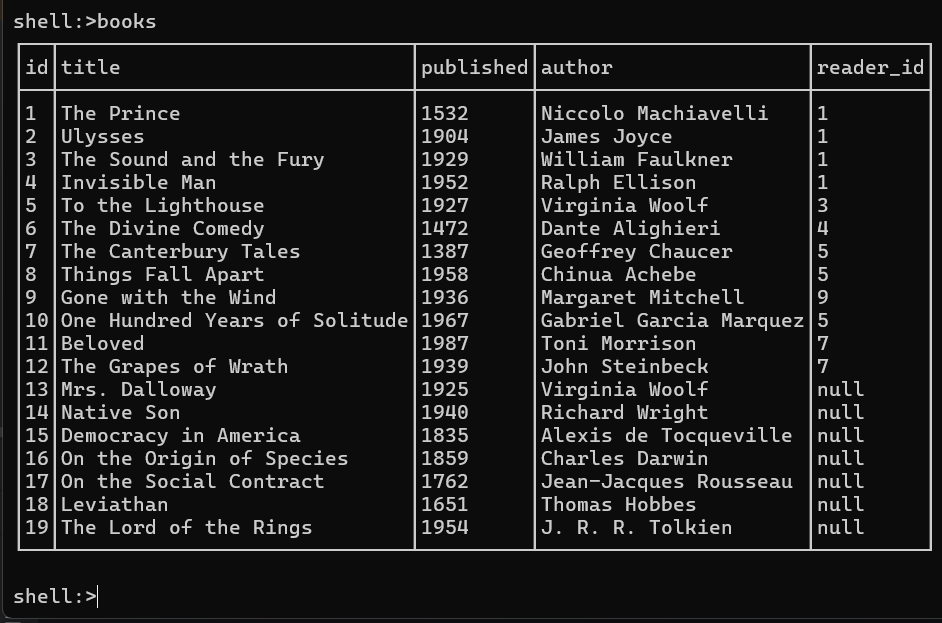

# Library Management System CLI

## Overview

The Library Management System CLI is a Java-based command-line application designed to manage library resources efficiently.

## Features

- **Book Management**: Add, update, delete, and search for books.
- **Member Management**: Add, update, delete, and search for library members.
- **Lending Records**: Manage book loans and returns.
- **Command-Line Interface**: User-friendly CLI for interacting with the system.

## Technologies Used

- **Java 21**
- **Spring Shell**
- **Spring Data Jpa**
- **Gradle**
- **PostgreSQL**
- **Flyway**
- **Docker & docker compose**

```
gradlew clean bootRun -q --console=plain
```

